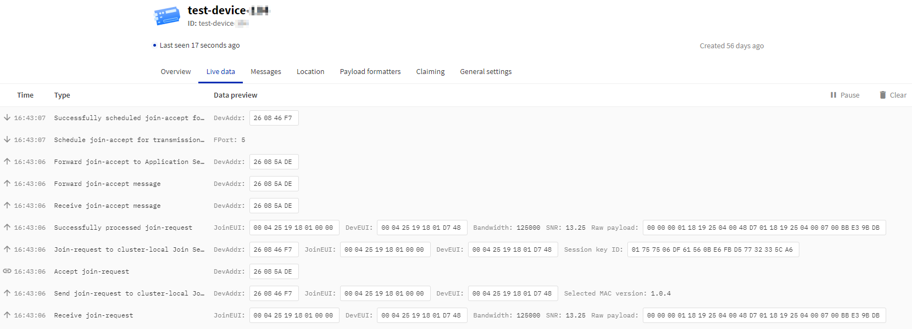
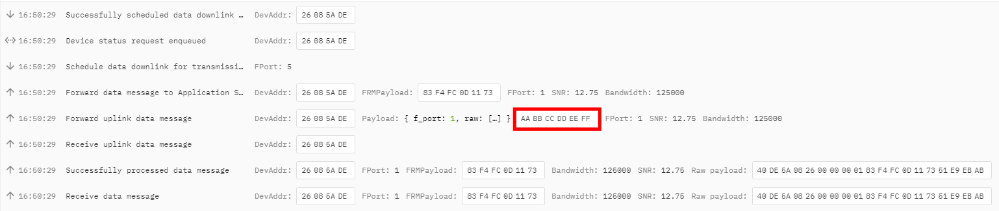
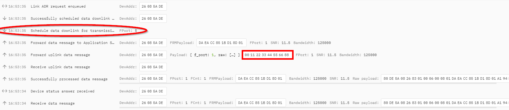

# Quick Start Guide
> "Wireless Made Easy!" - Control SAM R34 IC or WLR089U0 Module with ASCII commands over UART

[Back to Main page](../README.md)

## A la carte

1. [Hardware Setup](#step1)
1. [Software Setup](#step2)
1. [Plug In](#step3)
1. [Link Up](#step4)
1. [Send Data](#step5)
1. [Standby mode](#step5)

## Hardware Setup<a name="step1"></a>

| Device       | RF Transceiver | Supported Evaluation Kit | Supported IDEs   |
| ------------ | -------------- | ------------------------ | ---------------- |
| SAMR34J18B   | SX1276 (in SIP)| SAMR34 XPRO              | Atmel Studio v7.0|
| WLR089U0     | SX1276 (in SIP)| WLR089U0 Module XPRO     | Atmel Studio v7.0|

- Development Board:
  - [SAM R34 Xplained Pro](https://www.microchip.com/DevelopmentTools/ProductDetails/dm320111)\
or
  - [WLR089U0 Module Xplained Pro](https://www.microchip.com/DevelopmentTools/ProductDetails/PartNO/EV23M25A1)
- Micro-USB cable
- LoRaWAN Gateway (e.g. [The Things Industries](https://www.thethingsindustries.com/technology/hardware#gateway))

## Software Setup<a name="step2"></a>

- [Atmel Studio 7.0](https://www.microchip.com/mplab/avr-support/atmel-studio-7)
- [TeraTerm - Terminal Emulator](https://osdn.net/projects/ttssh2/releases/)
- Network Server with Gateway and end device registered
- LoRaWAN Gateway connected to Network Server

> Notice that Network Servers supporting LoRaWAN 1.04 will only be compatible with this sample code which use Microchip LoRaWAN Stack MLS_SDK_1_0_P_5
(The Things Industries server supports LoRaWAN 1.0.4).

## Plug In<a name="step3"></a>

- Connect your board (EDBG USB) to your computer with a micro USB cable. Your personal computer will recognize the board as a Virtual COM port.
- Open the virtual COM port in a terminal emulator

## Link Up<a name="step4"></a>

Connect to Network Server using pre-programmed provisioning keys

1. Open TeraTerm. Choose the EDBG Virtual COM port and enable local echo
2. The default settings for the UART interface are 115200 bps, 8-bit, no parity, one stop bit and no flow control (115200 8 N 1)
3. Press **RESET** button to reboot the board
```sh
Last reset cause: External Reset
LoRaWAN Stack UP
USER BOARD MLS_SDK_1_0_P_5 Oct 29 2020 16:10:55
```
4. Initialize the LoRaWAN stack using `mac reset <band>` command. Check out the [MAC Command User's Guide](../02_command_guide/README.md#step4) for more details.
```sh
mac reset 868
ok
```
5. Provision the device for OTAA with your own keys
```sh
mac set deveui 000425191801d748
mac set joineui 0004251918010000
mac set appkey 000425191801d748000425191801d748
 ```
6. Join the network
```sh
mac join otaa
ok
accepted
```
<p align="center">

</p>

## Send Data<a name="step5"></a>

1. Transmit unconfirmed message on port 1
```sh
mac tx uncnf 1 AABBCCDDEEFF
ok
mac_tx_ok
```
<p align="center">

</p>

2. Transmit confirmed message on port 1
```sh
mac tx cnf 1 0011223344556688
ok
mac_tx_ok
```
<p align="center">

</p>

## Standby mode<a name="step6"></a>

1. Place jumper J102 in **MEAS** position to measure MCU current
2. Place jumper J101 in **BY-PS** position to bypass I/Os current
3. Put the device in standby mode for 60 seconds
```sh
sys sleep standby 60000
..
sleep_ok 59991 ms

```

<p align="center">

</p>


<a href="#top">Back to top</a>

